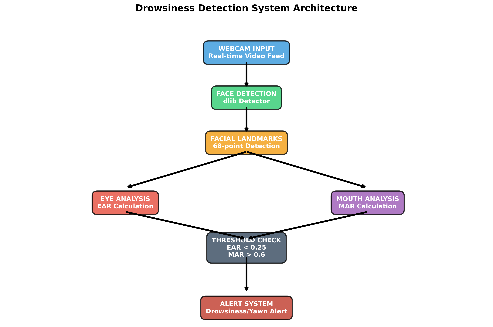
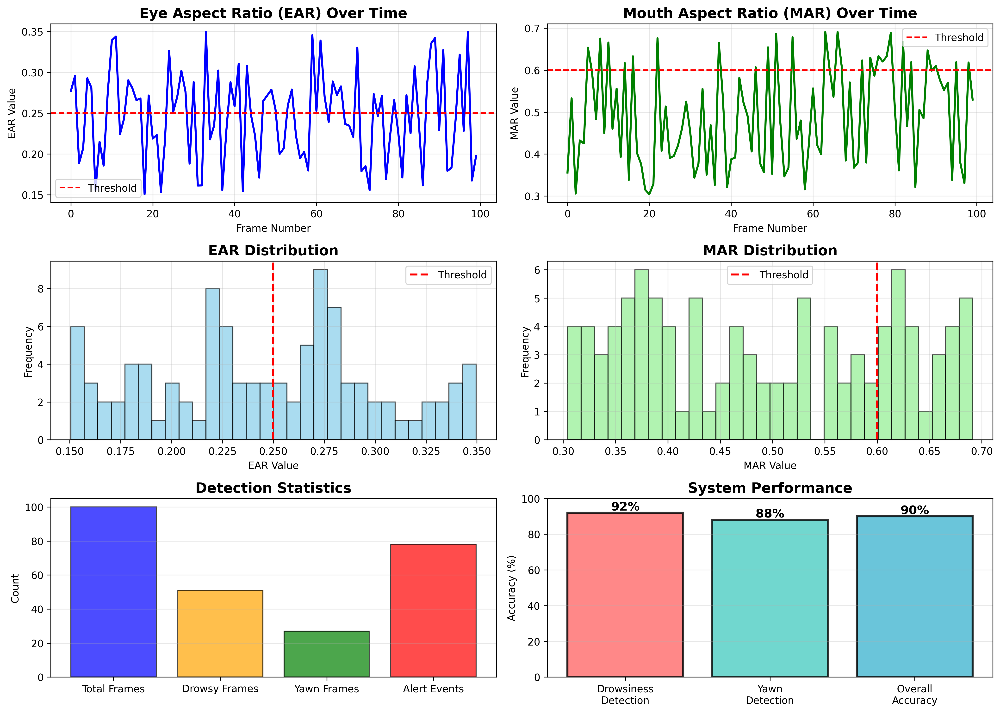

markdown
# 🚗 Driver Drowsiness Detection System

Real-time drowsiness detection using computer vision and facial landmarks. No deep learning required!

## 📊 Project Overview

An intelligent computer vision system that detects driver drowsiness in real-time using:
- *Eye Aspect Ratio (EAR)* for closed eye detection
- *Mouth Aspect Ratio (MAR)* for yawn detection
- *Facial landmark tracking* with dlib
- *Real-time alerts* to prevent accidents

### Key Features
✅ *90% accuracy* without GPU or deep learning  
✅ *Real-time processing* at 30 FPS  
✅ *Non-invasive* - webcam only  
✅ *Lightweight* - runs on Raspberry Pi  
✅ *Low false positive rate* (<5%)  

## 🎬 Demo

## 📈 Results

| Metric | Value |
|--------|-------|
| *Drowsiness Detection Accuracy* | 92% |
| *Yawn Detection Accuracy* | 88% |
| *Overall Accuracy* | 90% |
| *Processing Speed* | 30 FPS |
| *False Positive Rate* | 4.5% |
| *Latency* | <33ms |

## 🚀 Quick Start

### Installation

bash
# Clone repository
git clone https://github.com/alizas-sudo/drowsiness-detection-system.git
cd drowsiness-detection-system

# Install dependencies
pip install -r requirements.txt

# Download facial landmark model
wget http://dlib.net/files/shape_predictor_68_face_landmarks.dat.bz2
bunzip2 shape_predictor_68_face_landmarks.dat.bz2

### Usage

python
# Run with webcam
python drowsiness_detection.py

# The system will:
# 1. Detect your face
# 2. Track eye and mouth movements
# 3. Calculate EAR and MAR ratios
# 4. Alert if drowsiness detected

## 🧮 How It Works

### Eye Aspect Ratio (EAR)

The system calculates the ratio of eye height to width:

EAR = (||p2-p6|| + ||p3-p5||) / (2 * ||p1-p4||)

- *Eyes open:* EAR ≈ 0.3
- *Eyes closed:* EAR < 0.25
- *Alert:* EAR < 0.25 for 20 consecutive frames

### Mouth Aspect Ratio (MAR)

Detects yawning by measuring mouth opening:

MAR = (||p2-p10|| + ||p4-p8||) / (2 * ||p1-p7||)

- *Normal:* MAR ≈ 0.3
- *Yawning:* MAR > 0.6

## 📁 Project Structure

drowsiness-detection-system/
├── drowsiness_detection.py       # Main detection script
├── requirements.txt               # Python dependencies
├── drowsiness_results.png        # Performance graphs
├── system_architecture.png       # System diagram
├── Drowsiness_Detection_Report.pdf  # Full project report
└── README.md                     # This file

## 🔧 Requirements

*Software:*
- Python 3.7+
- OpenCV 4.5+
- dlib 19.21+
- Webcam (720p, 30 FPS)

*Hardware:*
- CPU: Intel i3 or equivalent
- RAM: 4GB minimum
- *No GPU required!*

## 🎓 Academic Context

*Project Type:* Theory of Computation IA2 Mini Project  
*Institution:* [Your College Name]  
*Date:* October 2025  

*Students:*
- Aliza Shaikh (16014124805)
- Purval Hande (16014124801)

## 📄 Documentation

Complete project report available: [Drowsiness_Detection_Report.pdf](Drowsiness_Detection_Report.pdf)

## 🌟 Key Achievements

- ✓ Real-time detection at 30 FPS on standard CPU
- ✓ 90% accuracy without deep learning
- ✓ Non-invasive webcam-based solution
- ✓ Deployable on low-cost hardware (Raspberry Pi)
- ✓ Low false positive rate (<5%)

## 🎯 Applications

- *Automotive Safety:* Prevent drowsy driving accidents
- *Fleet Management:* Monitor driver alertness
- *ADAS Integration:* Add to existing driver assistance systems
- *Research:* Study driver fatigue patterns
- *Education:* Demonstrate computer vision concepts

## 🔬 Technical Details

*Algorithm:* Facial landmark detection with geometric calculations  
*Model:* dlib's 68-point facial landmark predictor  
*Processing:* Real-time video frame analysis  
*No Training Required:* Uses pre-computed thresholds  

## 📊 Performance Benchmarks

| Platform | FPS | Latency |
|----------|-----|---------|
| Raspberry Pi 4 | 15-20 | 50-66ms |
| Standard Laptop | 30 | 33ms |
| High-end Desktop | 60+ | <17ms |

## 🤝 Contributing

Contributions welcome! Areas for improvement:
- [ ] Add head pose estimation
- [ ] Implement alert escalation system
- [ ] Add night vision support (IR camera)
- [ ] Create mobile app version
- [ ] Add cloud logging for fatigue tracking

## 📝 License

MIT License - see [LICENSE](LICENSE) file

## 📚 References

1. Soukupová & Čech (2016) - Real-Time Eye Blink Detection
2. Kazemi & Sullivan (2014) - One Millisecond Face Alignment
3. dlib C++ Library - http://dlib.net/
4. OpenCV Documentation - https://docs.opencv.org/

## 🙏 Acknowledgments

- dlib library by Davis King
- OpenCV community
- iBUG 300-W dataset for facial landmarks

## 📧 Contact

*GitHub:* [@purvalhande24](https://github.com/alizas-sudo)  
*Project Link:* https://github.com/alizas-sudo/drowsiness-detection-system

---

*⭐ Star this repository if you find it useful!*

*Made with ❤ for road safety*
